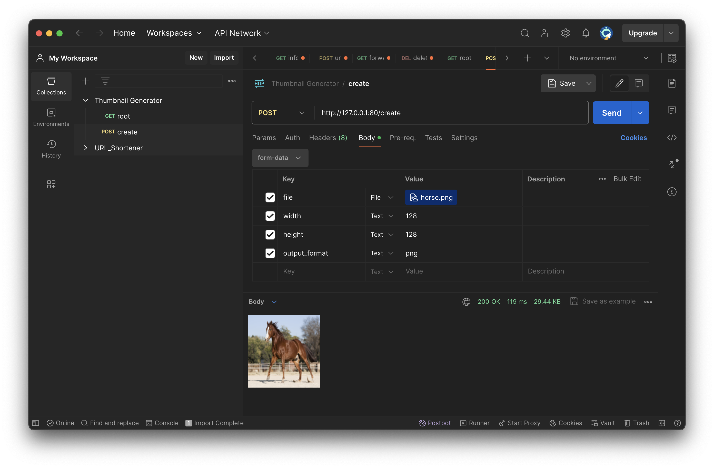

# Thumbnal Generator
Thumbnail generator API.

## Architecture
The application arquitecture is composed as follows:


## Limitations
The application has the following limitatinos:
- Maximum input file size is `10mb`, due to `AWS API Gateway`.
- Allowed input image types: `.PNG` and `.JPEG`.

## Local testing
Create virtual environment:
```bash
python -m venv venv
source venv/bin/activate
```
Install dependencies:
```bash
pip install -r requirements.txt
```


Start the local server:

```bash
uvicorn src.app.main:app --reload --port 80 
```
This will start a server at [http://127.0.0.0:80](http://127.0.0.0:80).

Documentation is available at: [http://127.0.0.0:80/docs](http://127.0.0.0:80:docs).


### Consumer example:
Use the following snippet to request a thumnnail using Python:
```python
import io

import requests
from PIL import Image

if __name__ == "__main__":
    with open("tests/horse.png", "rb") as f:
        response = requests.post(
            "http://127.0.0.1:80/create",
            data={
                "width": 128,
                "height": 128,
                "output_format": "png",
            },
            files={"file": f.read()},
        )

        image = Image.open(io.BytesIO(response.content))
        image.show()
```


## Postman collection
Import [this](postman-collection.json) postman collection to test the application out.


